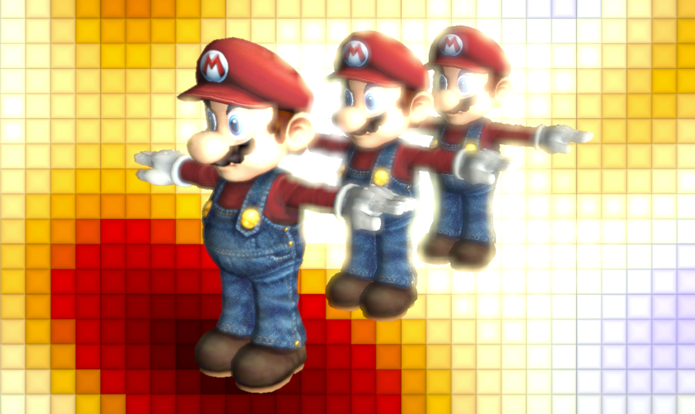
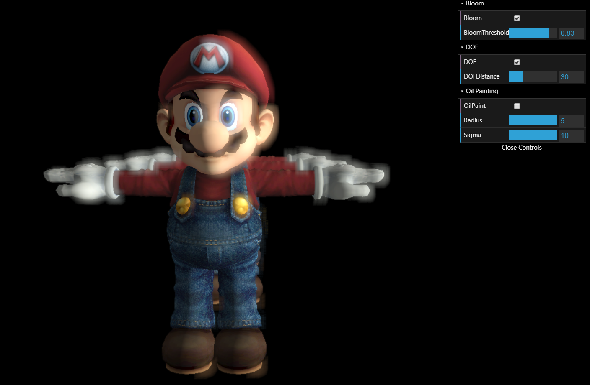
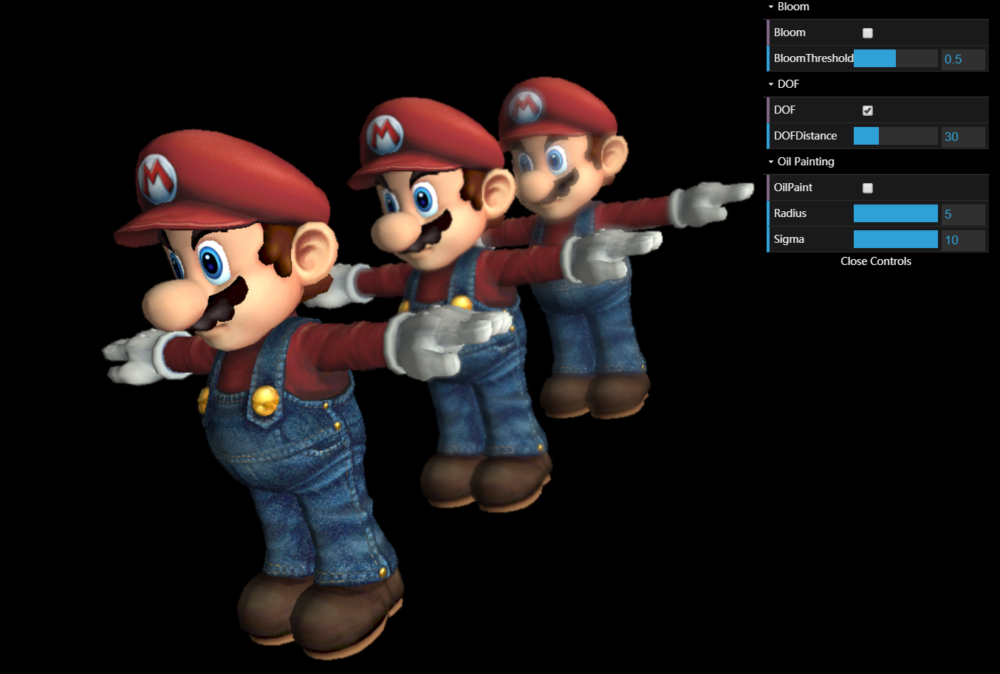
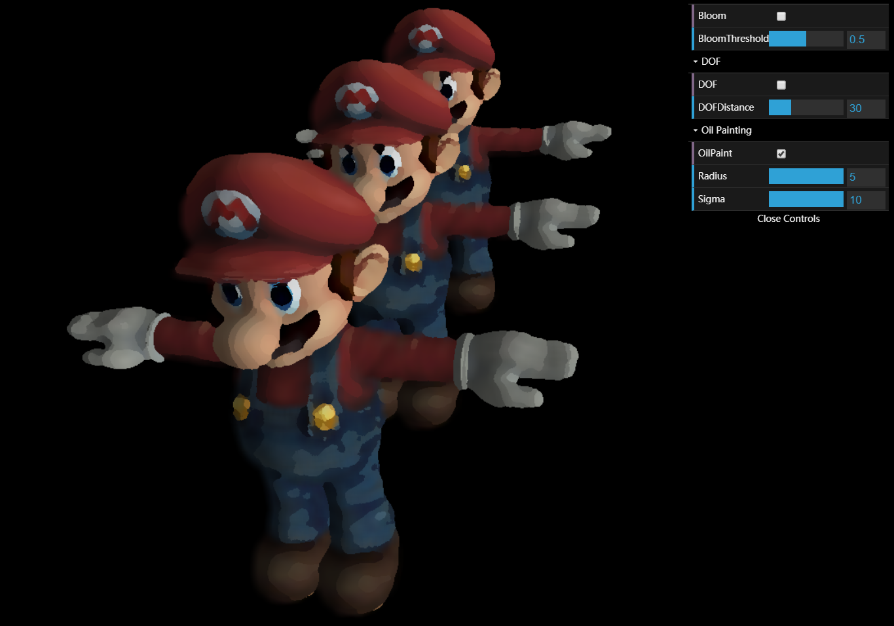

# Project 7: Deferred Renderer

Wanru Zhao, 59981278

  

    
  

-----
Demo Link : https://wanruzhao.github.io/homework-7-deferred-renderer-WanruZhao/

-----
### Implementation

- Lambertian surface reflection, ambient lighting, point light and procedural background
- Tone mapping
- Bloom
  - Bloom threshold controls how strong the bloom is, increasing the bloom threshold will increase the bloom effect.
  
  

    
  

  
- DOF
  - DOF distance controls the starting depth of blurring
  
  

    
  

  
- Oil Paint Effect
  - Radius and sigma control how obvious the oil paint effect is, simply change two values to maximal ones to see the obvious effect
  - Enable this effect will decrease the FPS, disable Bloom and DOF first
  
  

    
  

  
- GUI
  - Enable and disable post effects

#### Reference
  - Background: https://www.shadertoy.com/view/4tjGWy
  - Oil paint: http://supercomputingblog.com/graphics/oil-painting-algorithm/
